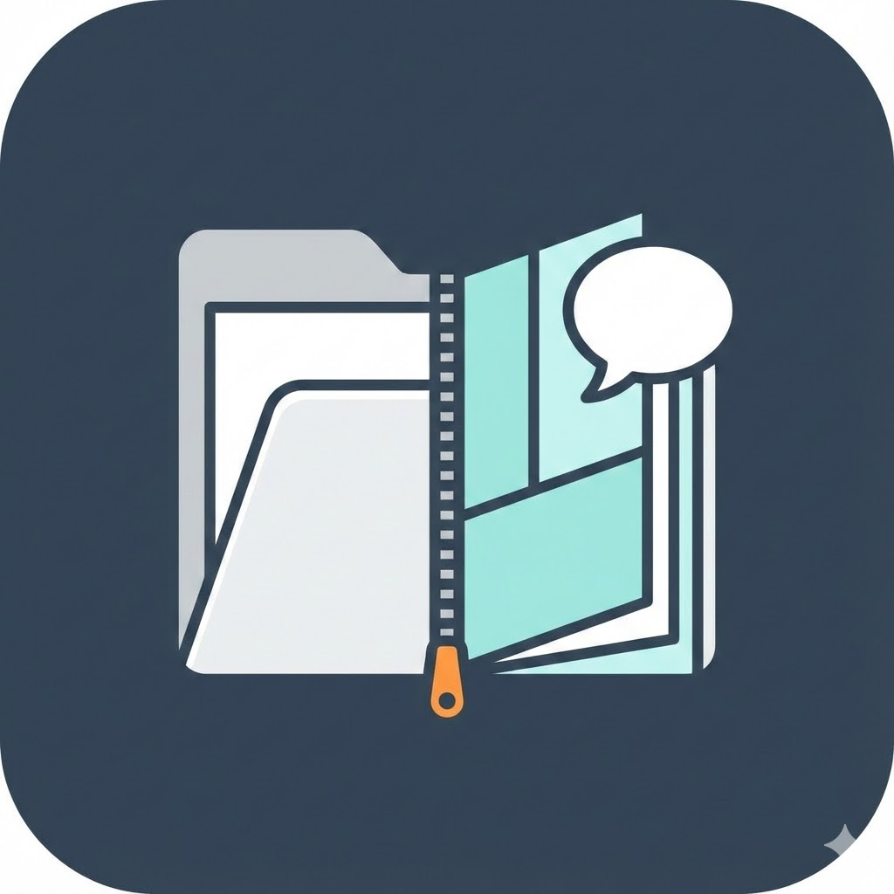
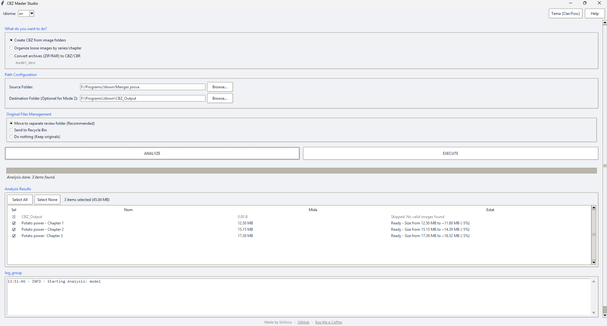

# CBZ Master Studio

**Select language / Selecciona idioma:**

- 🇬🇧 [English](#english)
- 🇪🇸 [Español](#español)
- 🇦🇩 [Català](#català)

---

## English

  

### CBZ Master Studio

**CBZ Master Studio** is a free and open-source Windows application designed to safely analyze, organize and convert image folders into **CBZ comic files**.

It is especially useful for organizing comics, manga and scanned artbooks, offering full control and a clear preview before any change is made.

---

### Main features

- Convert image folders into **CBZ** files (one CBZ per folder)
- Automatically group mixed images into subfolders
- Convert ZIP / RAR archives into CBZ
- Detect invalid folders (subfolders, unsupported files, long paths…)
- Two-step workflow: analyze first, execute later
- Select exactly which items will be processed
- Final summary with size savings and error log
- Safe management of original files

---

### Workflow (important)

CBZ Master Studio always works in **two clear steps**:

#### 1. Analyze
- Scans selected folders and files
- Calculates what will be created or moved
- Estimates final size and savings
- **Does not modify anything on disk**

#### 2. Execute
- Processes only the selected items
- Creates CBZ files
- Handles originals according to user choice
- Shows a final detailed summary

---

### Original files handling

After processing, you can choose to:
- Move originals to a separate folder (recommended)
- Send originals to the recycle bin
- Leave originals untouched

Files are **never deleted automatically**.

---

### Windows security notice

This application is **NOT digitally signed**.

- Windows may show a security warning
- You must manually allow execution

Reason:
- Code signing certificates are expensive
- This project is free and open-source
- The source code is public and auditable

---

### Open source

This project is open source.
You are free to:
- Inspect the code
- Fork it
- Propose improvements

---

### Author

**Created by SirSiscu**

- GitHub: https://github.com/SirSiscu  
- Buy Me a Coffee: https://buymeacoffee.com/francescsala  

---

### License

This project is released under the **MIT License**.
See the `LICENSE` file for details.

---

## Español

  

### CBZ Master Studio

**CBZ Master Studio** es una aplicación gratuita y de código abierto para Windows diseñada para analizar, organizar y convertir carpetas de imágenes en archivos **CBZ** de forma segura.

Está pensada para organizar cómics, manga y libros escaneados, permitiendo revisar todo antes de aplicar cambios.

---

### Funciones principales

- Conversión de carpetas de imágenes a **CBZ**
- Agrupación automática de imágenes mezcladas
- Conversión de archivos ZIP / RAR a CBZ
- Detección de carpetas no válidas
- Flujo en dos pasos: analizar y ejecutar
- Selección manual de los elementos a procesar
- Resumen final con ahorro de espacio y errores
- Gestión segura de los archivos originales

---

### Flujo de trabajo

#### 1. Analizar
- Examina los archivos seleccionados
- Calcula acciones y tamaños
- **No modifica nada**

#### 2. Ejecutar
- Aplica los cambios seleccionados
- Crea los CBZ
- Gestiona los originales
- Muestra un resumen final

---

### Gestión de originales

Opciones disponibles:
- Mover a una carpeta separada
- Enviar a la papelera de reciclaje
- No modificar la ubicación original

Nunca se borra nada sin confirmación.

---

### Aviso de seguridad de Windows

La aplicación **no está firmada digitalmente**.
Windows puede mostrar un aviso de seguridad.

El código es abierto y revisable.

---

### Código abierto

Proyecto open source.
Contribuciones bienvenidas.

---

### Autor

**Creado por SirSiscu**

- GitHub: https://github.com/SirSiscu  
- Buy Me a Coffee: https://buymeacoffee.com/francescsala  

---

### Licencia

Este proyecto usa la **licencia MIT**.
Consulta el archivo `LICENSE`.

---

## Català

  

### CBZ Master Studio

**CBZ Master Studio** és una aplicació gratuïta i de codi obert per a Windows dissenyada per analitzar, organitzar i convertir carpetes d’imatges en fitxers **CBZ** de manera segura.

Especialment útil per a còmics, manga i escanejos, permet revisar-ho tot abans d’aplicar cap canvi.

---

### Funcionalitats principals

- Conversió de carpetes d’imatges a **CBZ**
- Agrupació automàtica d’imatges barrejades
- Conversió de ZIP / RAR a CBZ
- Detecció de carpetes no vàlides
- Flux en dos passos: analitzar i executar
- Selecció manual dels elements a processar
- Resum final amb estalvi d’espai i errors
- Gestió segura dels originals

---

### Flux de funcionament

#### 1. Analitzar
- Examina els fitxers seleccionats
- Calcula accions i mides
- **No modifica res**

#### 2. Executar
- Aplica els canvis seleccionats
- Crea els CBZ
- Gestiona els originals
- Mostra un resum final

---

### Gestió dels originals

Opcions:
- Moure a una carpeta separada
- Enviar a la paperera
- No tocar els originals

Mai s’esborra res sense confirmació explícita.

---

### Avís de seguretat (Windows)

L’aplicació **no està signada digitalment**.
Windows pot mostrar un avís.

El codi és obert i auditable.

---

### Codi obert

Projecte open source.
Les contribucions són benvingudes.

---

### Autor

**Fet per SirSiscu**

- GitHub: https://github.com/SirSiscu  
- Buy Me a Coffee: https://buymeacoffee.com/francescsala  

---

### Llicència

Aquest projecte utilitza la **llicència MIT**.
Consulta el fitxer `LICENSE`.
